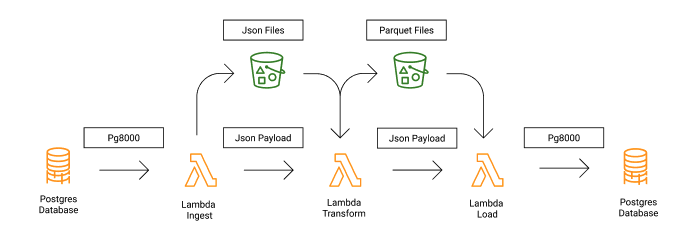

# Data Pipeline Project - Terrific Totes

## Overview
Terrific Totes is a fictional company that operates an OLTP database and a data warehouse used for reporting and visualizations. The goal of this project is to develop applications that Extract, Transform, and Load (ETL) data from the OLTP database into a data lake and warehouse hosted in AWS. This solution is reliable, scalable, and fully managed using Infrastructure-as-Code.

## Features
- **Automated Data Processing**
  - **EventBridge Scheduler**: Triggers data ingestion every 5 minutes.
  - **Step Machine with JSON Payloads**: Orchestrates the workflow.
  - **Lambda Functions & Layers**: 
    - One Python application ingests all tables from the `totesys` database. Implements incremental refresh so that only new
      and/or updated data is processed for optimisation of resources.
    - Another Python application remodels the data into a predefined schema and stores it in the "processed" S3 bucket in Parquet format.
    - A third Python application loads the transformed data into a data warehouse, with new and updated data reflected in the target database within 30 minutes. Fact tables retain a full history of how the data has evolved.
- **CloudWatch Monitoring & SNS Alerts**
  - Logs errors, tracks performance, and sends critical failure notifications via SNS.
- **Secure Data Management**
  - **IAM Policies**: Implements the principle of least privilege.
  - **Secrets Manager**: Manages database credentials securely.
- **Data Storage in S3**
  - **Raw Data Bucket**: Stores ingested data in its original form, acts as a data lake.
  - **Processed Data Bucket**: Holds transformed data in an immutable, well-structured format.
- **Code Quality & Security**
  - Python code is **PEP8 compliant**, thoroughly tested, and checked for security vulnerabilities using `pip-audit` and `bandit`.

## Architecture

   

## Tech Stack
- **Version Control**: GitHub
- **Infrastructure & CI/CD**: Terraform, GitHub Actions, Makefile
- **Programming & Libraries**: Python, boto3, pandas, numpy, pg8000, freezegun, coverage, bandit, black
- **AWS Services**: CloudWatch, Lambda, EventBridge, Step Functions, SNS, S3, Secrets Manager
- **Development Tools**: Visual Studio Code, Tableau

## Installation & Setup
1. **Create an AWS Account** and configure AWS credentials. 
   The AWS user will need administrative privileges to set up the following:
   - S3 Buckets
   - Step Machine
   - Lambda Functions
   - Cloudwatch
   - Secrets Manager
   - SNS
2. **Ensure you have Python 3.12 installed**  
   - Check your version:  
     ```sh
     python --version
     ```  
   - If needed, install it from [python.org](https://www.python.org/downloads/).
3. **Fork and Clone the Repository**  
   *(Approx. 3.8 MiB memory needed to clone and set up the repository)*
   ```sh   
   git clone https://github.com/ys218279/team-09-sperrins.git
   cd team-09-sperrins
   ```
4. **Set Up Databases**
   - Create test source and target databases from the provided ERDs.
   - Source DB: https://dbdiagram.io/d/SampleDB-6332fecf7b3d2034ffcaaa92
   - Target DB: https://dbdiagram.io/d/RevisedDW-63a19c5399cb1f3b55a27eca
5. **Store Credentials in GitHub secrets**
   - Store AWS credentials, database credentials, and SNS email in GitHub secrets.
6. **Install Terraform** (if not already installed)
   ```sh
   brew tap hashicorp/tap
   brew install hashicorp/tap/terraform
   ```
7. **Set Up Terraform Backend**
   - Create an S3 bucket to store Terraform state files.
8. **Run Makefile Commands**
   ```sh
   make all  # Creates virtual environment, installs dependencies, formats code, runs security and test coverage checks
   ```
9. **Deploy Infrastructure**
   ```sh
   cd terraform
   terraform init
   terraform plan
   terraform apply
   ```
   - During terraform apply, will be prompted to enter credentials in the terminal.
10. **(Alternative Method) Configure Sensitive Variables**
   - Create a `sensitive.tfvars` file with database credentials and SNS email.
11. **(Alternative Method) Deploy Infrastructure (Using Variables)**
   ```sh
   cd terraform
   terraform init
   terraform plan -var-file=sensitive.tfvars
   terraform apply -var-file=sensitive.tfvars
   ```
   *(If deploying via GitHub Actions, this step can be automated.)*

## Folder Structure
```
/team-09-sperrins
|-- .github/workflows/      # Automation files
|   |-- deploy.yml          # Script for CI/CD pipeline
|-- .layer/python/          # Lambda layer dependency files
|   |-- requirements.txt    # Lambda layer dependencies
|-- src/                    # Source code for the pipeline
|   |-- src_ingestion/      # Scripts for data extraction
|   |-- src_transform/      # Scripts for data transformation
|   |-- src_load/           # Scripts for data loading
|-- logs/                   # Logging output
|-- terraform/              # Terraform files
|-- test/                   # Unit and integration tests
|-- architecture.png        # Architecture diagram 
|-- ETL_architecture.png    # ETL Architecture diagram 
|-- mvp.png                 # Project brief diagram
|-- Makefile/               # Scripts for the env/installs/tests
|-- requirements.txt        # Project dependencies
|-- README.md               # Documentation for final project
|-- READMEBRIEF.md          # Documentation for project brief
```

## Contact
For any questions or issues, reach out via [GitHub Issues](https://github.com/ys218279/team-09-sperrins/issues).
